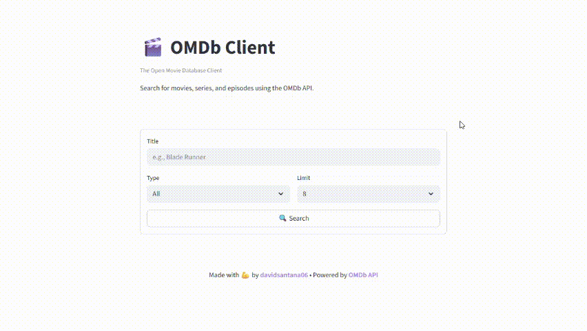

**🎬 OMDb Client** is a web application that allows searching for movies, series, and episodes by title through the **OMDb API**. For each result, it displays the poster, title, year, type, and a reference link to IMDb.


## 🛠️ Installation and Execution

Developed in **Python 3.12**, using this version is recommended to ensure compatibility. Follow these steps from the project root:

### 1️⃣ Configure Secrets

Create a `.streamlit/secrets.toml` file with:

```toml
OMDB_API_URL = "http://www.omdbapi.com/"
OMDB_API_KEY = "YOUR_OMDB_API_KEY"
IMDB_TITLE_URL = "https://www.imdb.com/title/"
```

### 2️⃣ Install Dependencies

```bash
pip install -r requirements.txt
```

### 3️⃣ Run the App

```bash
streamlit run main.py
```

## 🤝 Donation

If you like this project and want to support it financially, you can contribute via **PayPal** or **Pix** — _aos meus chegados do Brasil_ — by clicking one of the options below:

[](https://www.paypal.com/donate/?hosted_button_id=2P9HPGUP7Z43S)
[](https://tipa.ai/davidsantana06)

## ⚖️ License

This project uses the **MIT License**, allowing you to use and modify the code freely. The only requirement is to give proper credit, recognizing the effort and time invested.
